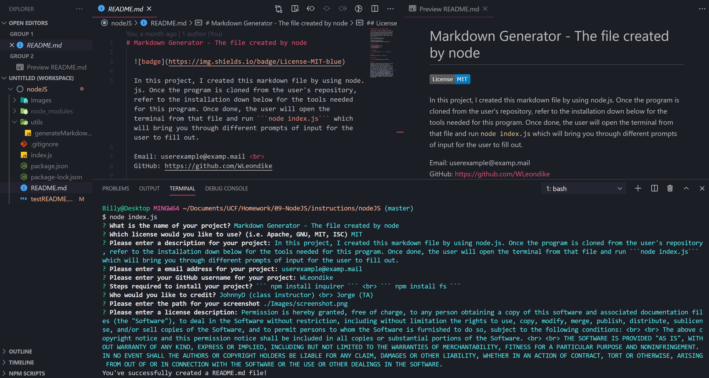

# Markdown Generator - The file created by node

  
  
  In this project, I created this markdown file by using node.js. Once the program is cloned from the user's repository, refer to the installation down below for the tools needed for this program. Once done, the user will open the terminal from that file and run ```node index.js``` which will bring you through different prompts of input for the user to fill out. The different fields in this markdown are this one, Installation, Credits, and License. These are the input fields this program will direct you through.  
  
  Email: userexample@examp.mail <br>
  GitHub: https://github.com/WLeondike

  Watch the demo video here:
   https://drive.google.com/file/d/1HBHGHghUtLTbbaznWtEL5O9Fd8vfw3AS/view?usp=sharing


  ## Table of Contents

  * [Installation](#installation)
  * [Credits](#credits)
  * [Screenshots](#screenshots)
  * [License](#license)
  

  ## Installation
  
  > ``` npm install inquirer ``` <br> ``` npm install fs ```
  
  
  ## Credits
  
  JohnnyD (class instructor) <br> Jorge (TA)


  ## Screenshots

  


  ## License

  Permission is hereby granted, free of charge, to any person obtaining a copy of this software and associated documentation files (the "Software"), to deal in the Software without restriction, including without limitation the rights to use, copy, modify, merge, publish, distribute, sublicense, and/or sell copies of the Software, and to permit persons to whom the Software is furnished to do so, subject to the following conditions: <br> <br> The above copyright notice and this permission notice shall be included in all copies or substantial portions of the Software. <br> <br> THE SOFTWARE IS PROVIDED "AS IS", WITHOUT WARRANTY OF ANY KIND, EXPRESS OR IMPLIED, INCLUDING BUT NOT LIMITED TO THE WARRANTIES OF MERCHANTABILITY, FITNESS FOR A PARTICULAR PURPOSE AND NONINFRINGEMENT. IN NO EVENT SHALL THE AUTHORS OR COPYRIGHT HOLDERS BE LIABLE FOR ANY CLAIM, DAMAGES OR OTHER LIABILITY, WHETHER IN AN ACTION OF CONTRACT, TORT OR OTHERWISE, ARISING FROM OUT OF OR IN CONNECTION WITH THE SOFTWARE OR THE USE OR OTHER DEALINGS IN THE SOFTWARE.